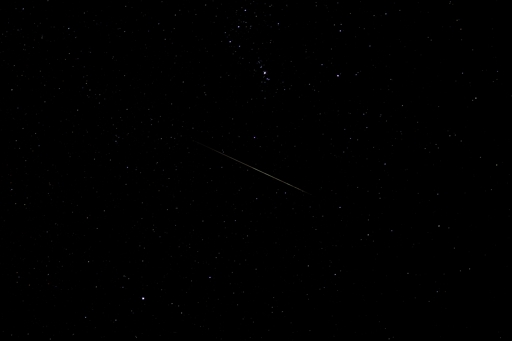
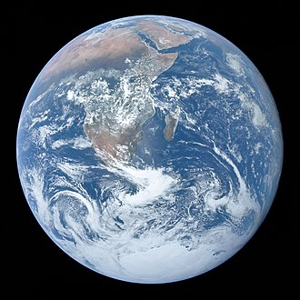
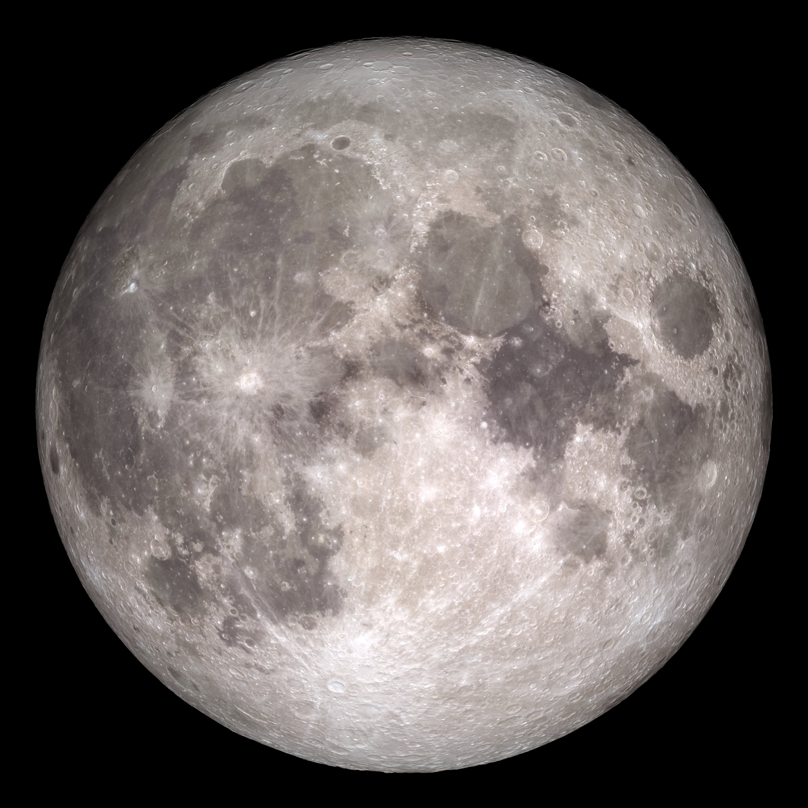

# Content:
by John Mihal and Nick Castronova
#### Team Miami

### Other Images: 
We might get more images if we need from https://www.pexels.com/search/.

For backgrounds and stuff.

# Planets/Sun:

## Sun:

### Overview:

The Sun is the star at the center of the Solar System. It is a nearly perfect ball of hot plasma, heated to incandescence by nuclear fusion reactions in its core, radiating the energy mainly as light, ultraviolet, and infrared radiation. It is the most important source of energy for life on Earth.

The Sun's radius is about 695,000 kilometers (432,000 miles), or 109 times that of Earth. Its mass is about 330,000 times that of Earth, comprising about 99.86% of the total mass of the Solar System. Roughly three-quarters of the Sun's mass consists of hydrogen (~73%); the rest is mostly helium (~25%), with much smaller quantities of heavier elements, including oxygen, carbon, neon, and iron.

The Sun is a G-type main-sequence star (G2V). As such, it is informally, and not completely accurately, referred to as a yellow dwarf (its light is actually white). It formed approximately 4.6 billion years ago from the gravitational collapse of matter within a region of a large molecular cloud. Most of this matter gathered in the center, whereas the rest flattened into an orbiting disk that became the Solar System. The central mass became so hot and dense that it eventually initiated nuclear fusion in its core. It is thought that almost all stars form by this process.

Every second, the Sun's core fuses about 600 million tons of hydrogen into helium, and in the process converts 4 million tons of matter into energy. This energy, which can take between 10,000 and 170,000 years to escape the core, is the source of the Sun's light and heat. When hydrogen fusion in its core has diminished to the point at which the Sun is no longer in hydrostatic equilibrium, its core will undergo a marked increase in density and temperature while its outer layers expand, eventually transforming the Sun into a red giant. It is calculated that the Sun will become sufficiently large to engulf the current orbits of Mercury and Venus, and render Earth uninhabitable – but not for about five billion years. After this, it will shed its outer layers and become a dense type of cooling star known as a white dwarf, and no longer produce energy by fusion, but still glow and give off heat from its previous fusion.

The enormous effect of the Sun on Earth has been recognized since prehistoric times. The Sun was thought of by some cultures as a deity. The synodic rotation of Earth and its orbit around the Sun are the basis of some solar calendars. The predominant calendar in use today is the Gregorian calendar which is based upon the standard 16th-century interpretation of the Sun's observed movement as actual movement.

### Composition:

The Sun is composed primarily of the chemical elements hydrogen and helium. At this time in the Sun's life, they account for 74.9% and 23.8%, respectively, of the mass of the Sun in the photosphere. All heavier elements, called metals in astronomy, account for less than 2% of the mass, with oxygen (roughly 1% of the Sun's mass), carbon (0.3%), neon (0.2%), and iron (0.2%) being the most abundant.

The Sun's original chemical composition was inherited from the interstellar medium out of which it formed. Originally it would have contained about 71.1% hydrogen, 27.4% helium, and 1.5% heavier elements. The hydrogen and most of the helium in the Sun would have been produced by Big Bang nucleosynthesis in the first 20 minutes of the universe, and the heavier elements were produced by previous generations of stars before the Sun was formed, and spread into the interstellar medium during the final stages of stellar life and by events such as supernovae.

Since the Sun formed, the main fusion process has involved fusing hydrogen into helium. Over the past 4.6 billion years, the amount of helium and its location within the Sun has gradually changed. Within the core, the proportion of helium has increased from about 24% to about 60% due to fusion, and some of the helium and heavy elements have settled from the photosphere towards the center of the Sun because of gravity. The proportions of heavier elements are unchanged. Heat is transferred outward from the Sun's core by radiation rather than by convection (see Radiative zone below), so the fusion products are not lifted outward by heat; they remain in the core and gradually an inner core of helium has begun to form that cannot be fused because presently the Sun's core is not hot or dense enough to fuse helium. In the current photosphere, the helium fraction is reduced, and the metallicity is only 84% of what it was in the protostellar phase (before nuclear fusion in the core started). In the future, helium will continue to accumulate in the core, and in about 5 billion years this gradual build-up will eventually cause the Sun to exit the main sequence and become a red giant.

The chemical composition of the photosphere is normally considered representative of the composition of the primordial Solar System. The solar heavy-element abundances described above are typically measured both using spectroscopy of the Sun's photosphere and by measuring abundances in meteorites that have never been heated to melting temperatures. These meteorites are thought to retain the composition of the protostellar Sun and are thus not affected by the settling of heavy elements. The two methods generally agree well.

### Core:

The core of the Sun extends from the center to about 20–25% of the solar radius. It has a density of up to 150 g/cm3 (about 150 times the density of water) and a temperature of close to 15.7 million Kelvin (K). By contrast, the Sun's surface temperature is approximately 5800 K. Recent analysis of SOHO mission data favors a faster rotation rate in the core than in the radiative zone above. Through most of the Sun's life, energy has been produced by nuclear fusion in the core region through the proton–proton chain; this process converts hydrogen into helium. Currently, only 0.8% of the energy generated in the Sun comes from another sequence of fusion reactions called the CNO cycle, though this proportion is expected to increase as the Sun becomes older and more luminous.

The core is the only region in the Sun that produces an appreciable amount of thermal energy through fusion; 99% of the power is generated within 24% of the Sun's radius, and by 30% of the radius, fusion has stopped nearly entirely. The remainder of the Sun is heated by this energy as it is transferred outwards through many successive layers, finally to the solar photosphere where it escapes into space through radiation (photons) or advection (massive particles).

The proton–proton chain occurs around 9.2×1037 times each second in the core, converting about 3.7×1038 protons into alpha particles (helium nuclei) every second (out of a total of ~8.9×1056 free protons in the Sun), or about 6.2×1011 kg/s. However, each proton (on average) takes around 9 billion years to fuse with one another using the PP chain. Fusing four free protons (hydrogen nuclei) into a single alpha particle (helium nucleus) releases around 0.7% of the fused mass as energy, so the Sun releases energy at the mass–energy conversion rate of 4.26 million metric tons per second (which requires 600 metric megatons of hydrogen), for 384.6 yottawatts (3.846×1026 W), or 9.192×1010 megatons of TNT per second. The large power output of the Sun is mainly due to the huge size and density of its core (compared to Earth and objects on Earth), with only a fairly small amount of power being generated per cubic meter. Theoretical models of the Sun's interior indicate a maximum power density, or energy production, of approximately 276.5 watts per cubic meter at the center of the core, which is about the same power density inside a compost pile.

The fusion rate in the core is in a self-correcting equilibrium: a slightly higher rate of fusion would cause the core to heat up more and expand slightly against the weight of the outer layers, reducing the density and hence the fusion rate and correcting the perturbation; and a slightly lower rate would cause the core to cool and shrink slightly, increasing the density and increasing the fusion rate and again reverting it to its present rate.

### Atmosphere:

During a total solar eclipse, when the disk of the Sun is covered by that of the Moon, parts of the Sun's surrounding atmosphere can be seen. It is composed of four distinct parts: the chromosphere, the transition region, the corona and the heliosphere.

The coolest layer of the Sun is a temperature minimum region extending to about 500 km above the photosphere, and has a temperature of about 4,100 K. This part of the Sun is cool enough to allow the existence of simple molecules such as carbon monoxide and water, which can be detected via their absorption spectra.

The chromosphere, transition region, and corona are much hotter than the surface of the Sun. The reason is not well understood, but evidence suggests that Alfvén waves may have enough energy to heat the corona.

Above the temperature minimum layer is a layer about 2,000 km thick, dominated by a spectrum of emission and absorption lines. It is called the chromosphere from the Greek root chroma, meaning color, because the chromosphere is visible as a colored flash at the beginning and end of total solar eclipses. The temperature of the chromosphere increases gradually with altitude, ranging up to around 20,000 K near the top. In the upper part of the chromosphere helium becomes partially ionized.

Above the chromosphere, in a thin (about 200 km) transition region, the temperature rises rapidly from around 20,000 K in the upper chromosphere to coronal temperatures closer to 1,000,000 K. The temperature increase is facilitated by the full ionization of helium in the transition region, which significantly reduces radiative cooling of the plasma. The transition region does not occur at a well-defined altitude. Rather, it forms a kind of nimbus around chromospheric features such as spicules and filaments, and is in constant, chaotic motion. The transition region is not easily visible from Earth's surface, but is readily observable from space by instruments sensitive to the extreme ultraviolet portion of the spectrum.

The corona is the next layer of the Sun. The low corona, near the surface of the Sun, has a particle density around 1015 m−3 to 1016 m−3. The average temperature of the corona and solar wind is about 1,000,000–2,000,000 K; however, in the hottest regions it is 8,000,000–20,000,000 K. Although no complete theory yet exists to account for the temperature of the corona, at least some of its heat is known to be from magnetic reconnection. The corona is the extended atmosphere of the Sun, which has a volume much larger than the volume enclosed by the Sun's photosphere. A flow of plasma outward from the Sun into interplanetary space is the solar wind.

The heliosphere, the tenuous outermost atmosphere of the Sun, is filled with the solar wind plasma. This outermost layer of the Sun is defined to begin at the distance where the flow of the solar wind becomes superalfvénic—that is, where the flow becomes faster than the speed of Alfvén waves, at approximately 20 solar radii (0.1 AU). Turbulence and dynamic forces in the heliosphere cannot affect the shape of the solar corona within, because the information can only travel at the speed of Alfvén waves. The solar wind travels outward continuously through the heliosphere, forming the solar magnetic field into a spiral shape, until it impacts the heliopause more than 50 AU from the Sun. In December 2004, the Voyager 1 probe passed through a shock front that is thought to be part of the heliopause. In late 2012 Voyager 1 recorded a marked increase in cosmic ray collisions and a sharp drop in lower energy particles from the solar wind, which suggested that the probe had passed through the heliopause and entered the interstellar medium, and indeed did so August 25, 2012 at approximately 122 astronomical units from the Sun. The heliosphere has a heliotail which stretches out behind it due to the Sun's movement.

On April 28, 2021, during its eighth flyby of the Sun, NASA's Parker Solar Probe encountered the specific magnetic and particle conditions at 18.8 solar radii that indicated that it penetrated the Alfvén surface, the boundary separating the corona from the solar wind defined as where the coronal plasma's Alfvén speed and the large-scale solar wind speed are equal. The probe measured the solar wind plasma environment with its fields and sweep instruments. This event was described by NASA as "touching the Sun''. During the flyby, Parker Solar Probe passed into and out of the corona several times. This proved the predictions that the Alfvén critical surface isn't shaped like a smooth ball, but has spikes and valleys that wrinkle its surface.

### Distance to Earth:

The distances can vary between 147,083,346 km to 152,112,126 km.

### Fun Fact:

The Sun is by far the brightest object in the Earth's sky, with an apparent magnitude of −26.74. This is about 13 billion times brighter than the next brightest star, Sirius, which has an apparent magnitude of −1.46

### Metrics:

Mass - 1.9885×1030 kg

surface gravity	 - 28 × Earth

Age ≈ 4.6 billion years

### Pictures:

[https://imgs.search.brave.com/46iT0JZjU8QvUT_rJ-sJ9dCsW_bQFY9wzOroz-z37JE/rs:fit:230:225:1/g:ce/aHR0cHM6Ly90c2Uy/Lm1tLmJpbmcubmV0/L3RoP2lkPU9JUC5Q/YUg1Z1JJb2plOUZK/ZzRFdi01UVZRQUFB/QSZwaWQ9QXBp](https://imgs.search.brave.com/46iT0JZjU8QvUT_rJ-sJ9dCsW_bQFY9wzOroz-z37JE/rs:fit:230:225:1/g:ce/aHR0cHM6Ly90c2Uy/Lm1tLmJpbmcubmV0/L3RoP2lkPU9JUC5Q/YUg1Z1JJb2plOUZK/ZzRFdi01UVZRQUFB/QSZwaWQ9QXBp)

[https://imgs.search.brave.com/7VxkijWccKsznp7ZQPrBYi-6GOAuELNhJP4dJyeAYOM/rs:fit:948:225:1/g:ce/aHR0cHM6Ly90c2Ux/Lm1tLmJpbmcubmV0/L3RoP2lkPU9JUC5l/T2FZWml4eVN4dElv/SEpPdXdGZnJnSGFE/dCZwaWQ9QXBp](https://imgs.search.brave.com/7VxkijWccKsznp7ZQPrBYi-6GOAuELNhJP4dJyeAYOM/rs:fit:948:225:1/g:ce/aHR0cHM6Ly90c2Ux/Lm1tLmJpbmcubmV0/L3RoP2lkPU9JUC5l/T2FZWml4eVN4dElv/SEpPdXdGZnJnSGFE/dCZwaWQ9QXBp)

### Citations: https://en.wikipedia.org/wiki/

## Mercury:

### Description:

Mercury is the smallest planet in the Solar System and the closest to the Sun. Its orbit around the Sun takes 87.97 Earth days, the shortest of all the Sun's planets. It is named after the Roman god Mercurius (Mercury), god of commerce, messenger of the gods, and mediator between gods and mortals, corresponding to the Greek god Hermes (Ἑρμῆς). Like Venus, Mercury orbits the Sun within Earth's orbit as an inferior planet, and its apparent distance from the Sun as viewed from Earth never exceeds 28°. This proximity to the Sun means the planet can only be seen near the western horizon after sunset or the eastern horizon before sunrise, usually in twilight. At this time, it may appear as a bright star-like object, but is more difficult to observe than Venus. From Earth, the planet telescopically displays the complete range of phases, similar to Venus and the Moon, which recurs over its synodic period of approximately 116 days.

Mercury rotates in a way that is unique in the Solar System. It is tidally locked with the Sun in a 3:2 spin–orbit resonance, meaning that relative to the fixed stars, it rotates on its axis exactly three times for every two revolutions it makes around the Sun. As seen from the Sun, in a frame of reference that rotates with the orbital motion, it appears to rotate only once every two Mercurian years. An observer on Mercury would therefore see only one day every two Mercurian years.

Mercury's axis has the smallest tilt of any of the Solar System's planets (about 1⁄30 degree). Its orbital eccentricity is the largest of all known planets in the Solar System; at perihelion, Mercury's distance from the Sun is only about two-thirds (or 66%) of its distance at aphelion. Mercury's surface appears heavily cratered and is similar in appearance to the Moon's, indicating that it has been geologically inactive for billions of years. Having almost no atmosphere to retain heat, it has surface temperatures that vary diurnally more than on any other planet in the Solar System, ranging from 100 K (−173 °C; −280 °F) at night to 700 K (427 °C; 800 °F) during the day across the equatorial regions. The polar regions are constantly below 180 K (−93 °C; −136 °F). The planet has no known natural satellites.

Two spacecraft have visited Mercury: Mariner 10 flew by in 1974 and 1975; and MESSENGER, launched in 2004, orbited Mercury over 4,000 times in four years before exhausting its fuel and crashing into the planet's surface on April 30, 2015. The BepiColombo spacecraft is planned to arrive at Mercury in 2025.

### Geology:

Mercury's surface is similar in appearance to that of the Moon, showing extensive mare-like plains and heavy cratering, indicating that it has been geologically inactive for billions of years. It is more heterogeneous than the surface of Mars or the Moon, both of which contain significant stretches of similar geology, such as maria and plateaus. Albedo features are areas of markedly different reflectivity, which include impact craters, the resulting ejecta, and ray systems. Larger albedo features correspond to higher reflectivity plains. Mercury has dorsa (also called "wrinkle-ridges"), Moon-like highlands, montes (mountains), planitiae (plains), rupes (escarpments), and valles (valleys).

The planet's mantle is chemically heterogeneous, suggesting the planet went through a magma ocean phase early in its history. Crystallization of minerals and convective overturn resulted in layered, chemically heterogeneous crust with large-scale variations in chemical composition observed on the surface. The crust is low in iron but high in sulfur, resulting from the stronger early chemically reducing conditions than is found in the other terrestrial planets. The surface is dominated by iron-poor pyroxene and olivine, as represented by enstatite and forsterite, respectively, along with sodium-rich plagioclase and minerals of mixed magnesium, calcium, and iron-sulfide. The less reflective regions of the crust are high in carbon, most likely in the form of graphite.

Names for features on Mercury come from a variety of sources. Names coming from people are limited to the deceased. Craters are named for artists, musicians, painters, and authors who have made outstanding or fundamental contributions to their field. Ridges, or dorsa, are named for scientists who have contributed to the study of Mercury. Depressions or fossae are named for works of architecture. Montes are named for the word "hot" in a variety of languages. Plains or planitiae are named for Mercury in various languages. Escarpments or rupēs are named for ships of scientific expeditions. Valleys or valles are named for abandoned cities, towns, or settlements of antiquity.

Mercury was heavily bombarded by comets and asteroids during and shortly following its formation 4.6 billion years ago, as well as during a possibly separate subsequent episode called the Late Heavy Bombardment that ended 3.8 billion years ago. Mercury received impacts over its entire surface during this period of intense crater formation, facilitated by the lack of any atmosphere to slow impactors down. During this time Mercury was volcanically active; basins were filled by magma, producing smooth plains similar to the maria found on the Moon. An unusual crater with radiating troughs has been discovered that scientists called "the spider". It was later named Apollodorus.

Craters on Mercury range in diameter from small bowl-shaped cavities to multi-ring impact basins hundreds of kilometers across. They appear in all states of degradation, from relatively fresh rayed craters to highly degraded crater remnants. Mercurian craters differ subtly from lunar craters in that the area blanketed by their ejecta is much smaller, a consequence of Mercury's stronger surface gravity. According to International Astronomical Union (IAU) rules, each new crater must be named after an artist who was famous for more than fifty years, and dead for more than three years, before the date the crater is named.

Perspective view of Caloris Basin – high (red); low (blue)

The largest known crater is Caloris Planitia, or Caloris Basin, with a diameter of 1,550 km. The impact that created the Caloris Basin was so powerful that it caused lava eruptions and left a concentric mountainous ring ~2 km tall surrounding the impact crater. The floor of the Caloris Basin is filled by a geologically distinct flat plain, broken up by ridges and fractures in a roughly polygonal pattern. It is not clear whether they are volcanic lava flows induced by the impact or a large sheet of impact melt.

At the antipode of the Caloris Basin is a large region of unusual, hilly terrain known as the "Weird Terrain". One hypothesis for its origin is that shock waves generated during the Caloris impact traveled around Mercury, converging at the basin's antipode (180 degrees away). The resulting high stresses fractured the surface. Alternatively, it has been suggested that this terrain formed as a result of the convergence of ejecta at this basin's antipode.

Tolstoj basin is along the bottom of this image of Mercury's limb

Overall, 46 impact basins have been identified. A notable basin is the 400 km wide, multi-ring Tolstoj Basin that has an ejecta blanket extending up to 500 km from its rim and a floor that has been filled by smooth plains materials. Beethoven Basin has a similar-sized ejecta blanket and a 625 km diameter rim. Like the Moon, the surface of Mercury has likely incurred the effects of space weathering processes, including solar wind and micrometeorite impacts.

### Pictures:

### Other Info:
* is of type: Terrestrial
* may have: moons (entity) - None
* has: name - Mercury
* has: pictures
* has: Atmosphere - None
* may have: Geology
* has: Size and gravity - 3.3011×1023 kg 3.7 m/s2
* has: Distance From earth - 77 million km to 222 million km
* has: description
* has: Fun Fact - It takes 87.969 Earth days for Mercury to complete its orbit.

## Venus:

### Type:

Terrestrial

### Pictures:

### Atmosphere:

Venus has an extremely dense atmosphere composed of 96.5% carbon dioxide, 3.5% nitrogen—both exist as supercritical fluids at the planet's surface—and traces of other gasses including sulfur dioxide. The mass of its atmosphere is 92 times that of Earth's, whereas the pressure at its surface is about 93 times that at Earth's—a pressure equivalent to that at a depth of nearly 1 km (5⁄8 mi) under Earth's oceans. The density at the surface is 65 kg/m3 (4.1 lb/cu ft), 6.5% that of water or 50 times as dense as Earth's atmosphere at 293 K (20 °C; 68 °F) at sea level. The CO2-rich atmosphere generates the strongest greenhouse effect in the Solar System, creating surface temperatures of at least 735 K (462 °C; 864 °F). This makes the Venusian surface hotter than Mercury's, which has a minimum surface temperature of 53 K (−220 °C; −364 °F) and maximum surface temperature of 700 K (427 °C; 801 °F), even though Venus is nearly twice Mercury's distance from the Sun and thus receives only 25% of Mercury's solar irradiance. Because of its runaway greenhouse effect, Venus has been identified by scientists such as Carl Sagan as a warning and research object linked to climate change on Earth.

Venus's atmosphere is extremely rich in primordial noble gasses compared to that of Earth. This enrichment indicates an early divergence from Earth in evolution. An unusually large comet impact or accretion of a more massive primary atmosphere from solar nebulae have been proposed to explain the enrichment. However, the atmosphere is also depleted of radiogenic argon, a proxy to mantle degassing, suggesting an early shutdown of major magmatism.

Studies which have suggested that billions of years ago, Venus's atmosphere could have been much more like the one surrounding the early Earth, and that there may have been substantial quantities of liquid water on the surface. After a period of 600 million to several billion years, solar forcing from rising luminosity of the Sun caused the evaporation of the original water. A runaway greenhouse effect was created once a critical level of greenhouse gasses (including water) was added to its atmosphere. Although the surface conditions on Venus are no longer hospitable to any Earth-like life that may have formed before this event, there is speculation on the possibility that life exists in the upper cloud layers of Venus, 50 km (30 mi) up from the surface, where the temperature ranges between 303 and 353 K (30 and 80 °C; 86 and 176 °F) but the environment is acidic. The putative detection of an absorption line of phosphine in Venus's atmosphere, with no known pathway for abiotic production, led to speculation in September 2020 that there could be extant life currently present in the atmosphere. Later research attributed the spectroscopic signal that was interpreted as phosphine to sulfur dioxide, or found that in fact there was no absorption line.

Thermal inertia and the transfer of heat by winds in the lower atmosphere mean that the temperature of Venus's surface does not vary significantly between the planet's two hemispheres, those facing and not facing the Sun, despite Venus's extremely slow rotation. Winds at the surface are slow, moving at a few kilometers per hour, but because of the high density of the atmosphere at the surface, they exert a significant amount of force against obstructions, and transport dust and small stones across the surface. This alone would make it difficult for a human to walk through, even without the heat, pressure, and lack of oxygen.

Above the dense CO2 layer are thick clouds, consisting mainly of sulfuric acid, which is formed by sulfur dioxide and water through a chemical reaction resulting in sulfuric acid hydrate. Additionally, the atmosphere consists of approximately 1% ferric chloride. Other possible constituents of the cloud particles are ferric sulfate, aluminum chloride and phosphoric anhydride. Clouds at different levels have different compositions and particle size distributions. These clouds reflect and scatter about 90% of the sunlight that falls on them back into space, and prevent visual observation of Venus's surface. The permanent cloud cover means that although Venus is closer than Earth to the Sun, it receives less sunlight on the ground. Strong 300 km/h (185 mph) winds at the cloud tops go around Venus about every four to five Earth days. Winds on Venus move at up to 60 times the speed of its rotation, whereas Earth's fastest winds are only 10–20% rotation speed.

The surface of Venus is effectively isothermal; it retains a constant temperature not only between the two hemispheres but between the equator and the poles. Venus's minute axial tilt—less than 3°, compared to 23° on Earth—also minimizes seasonal temperature variation. Altitude is one of the few factors that affect Venusian temperature. The highest point on Venus, Maxwell Montes, is therefore the coolest point on Venus, with a temperature of about 655 K (380 °C; 715 °F) and an atmospheric pressure of about 4.5 MPa (45 bar). In 1995, the Magellan spacecraft imaged a highly reflective substance at the tops of the highest mountain peaks that bore a strong resemblance to terrestrial snow. This substance likely formed from a similar process to snow, albeit at a far higher temperature. Too volatile to condense on the surface, it rose in gaseous form to higher elevations, where it is cooler and could precipitate. The identity of this substance is not known with certainty, but speculation has ranged from elemental tellurium to lead sulfide (galena).

Although Venus has no seasons as such, in 2019, astronomers identified a cyclical variation in sunlight absorption by the atmosphere, possibly caused by opaque, absorbing particles suspended in the upper clouds. The variation causes observed changes in the speed of Venus's zonal winds and appears to rise and fall in time with the Sun's 11-year sunspot cycle.

The existence of lightning in the atmosphere of Venus has been controversial since the first suspected bursts were detected by the Soviet Venera probes. In 2006–07, Venus Express clearly detected whistler mode waves, the signatures of lightning. Their intermittent appearance indicates a pattern associated with weather activity. According to these measurements, the lightning rate is at least half of that on Earth, however other instruments have not detected lightning at all. The origin of any lightning remains unclear, but could originate from the clouds or volcanoes.

In 2007, Venus Express discovered that a huge double atmospheric vortex exists at the south pole. Venus Express also discovered, in 2011, that an ozone layer exists high in the atmosphere of Venus. On 29 January 2013, ESA scientists reported that the ionosphere of Venus streams outwards in a manner similar to "the ion tail seen streaming from a comet under similar conditions."

In December 2015, and to a lesser extent in April and May 2016, researchers working on Japan's Akatsuki mission observed bow shapes in the atmosphere of Venus. This was considered direct evidence of the existence of perhaps the largest stationary gravity waves in the solar system.

### Geology:

The Venusian surface was a subject of speculation until some of its secrets were revealed by planetary science in the 20th century. Venera landers in 1975 and 1982 returned images of a surface covered in sediment and relatively angular rocks. The surface was mapped in detail by Magellan in 1990–91. The ground shows evidence of extensive volcanism, and the sulfur in the atmosphere may indicate that there have been recent eruptions.

About 80% of the Venusian surface is covered by smooth, volcanic plains, consisting of 70% plains with wrinkle ridges and 10% smooth or lobate plains. Two highland "continents" make up the rest of its surface area, one lying in the planet's northern hemisphere and the other just south of the equator. The northern continent is called Ishtar Terra after Ishtar, the Babylonian goddess of love, and is about the size of Australia. Maxwell Montes, the highest mountain on Venus, lies on Ishtar Terra. Its peak is 11 km (7 mi) above the Venusian average surface elevation. The southern continent is called Aphrodite Terra, after the Greek goddess of love, and is the larger of the two highland regions at roughly the size of South America. A network of fractures and faults covers much of this area.

The absence of evidence of lava flow accompanying any of the visible calderas remains an enigma. The planet has few impact craters, demonstrating that the surface is relatively young, at 300–600 million years old. Venus has some unique surface features in addition to the impact craters, mountains, and valleys commonly found on rocky planets. Among these are flat-topped volcanic features called "farra", which look somewhat like pancakes and range in size from 20 to 50 km (12 to 31 mi) across, and from 100 to 1,000 m (330 to 3,280 ft) high; radial, star-like fracture systems called "novae"; features with both radial and concentric fractures resembling spider webs, known as "arachnoids"; and "coronae", circular rings of fractures sometimes surrounded by a depression. These features are volcanic in origin.

Most Venusian surface features are named after historical and mythological women. Exceptions are Maxwell Montes, named after James Clerk Maxwell, and highland regions Alpha Regio, Beta Regio, and Ovda Regio. The last three features were named before the current system was adopted by the International Astronomical Union, the body which oversees planetary nomenclature.

The longitude of physical features on Venus are expressed relative to its prime meridian. The original prime meridian passed through the radar-bright spot at the center of the oval feature Eve, located south of Alpha Regio. After the Venera missions were completed, the prime meridian was redefined to pass through the central peak in the crater Ariadne on Sedna Planitia.

The stratigraphically oldest tessera terrains have consistently lower thermal emissivity than the surrounding basaltic plains measured by Venus Express and Magellan, indicating a different, possibly a more felsic, mineral assemblage. The mechanism to generate a large amount of felsic crust usually requires the presence of water ocean and plate tectonics, implying that habitable conditions had existed on early Venus. However, the nature of tessera terrains is far from certain.

### Size and gravity:

Size - 8.87 m/s2, gravity - 6,051.8 km

### Distance From earth:

Closest - 38.2 million km, Farthest - 261.0 million km

### Description:

Venus is the second planet from the Sun and is named after the Roman goddess of love and beauty. As the brightest natural object in Earth's night sky after the Moon, Venus can cast shadows and can be visible to the naked eye in broad daylight. Venus's orbit is smaller than that of Earth, but its maximal elongation is 47°; thus, at latitudes with a day-night cycle, it is most readily visible for up to a few hours following the start of sunset or before sunrise. Unlike Mercury, which can only be observed during twilight, Venus can be seen in a completely dark sky. Venus orbits the Sun every 224.7 Earth days, but rotates around its axis in 243 Earth days. Consequently, it takes longer to rotate about its axis than any other planet in the Solar System, and does so in the opposite direction to all but Uranus. This means that the Sun rises from its western horizon and sets in its east. This retrograde rotation creates a synodic day of only 117 Earth days. Venus does not have any moons, a distinction it shares only with Mercury among the planets in the Solar System.

The third smallest planet in the Solar System, Venus is a terrestrial planet and is sometimes called Earth's "sister planet" because of their similar size, mass, proximity to the Sun, and bulk composition. It is radically different from Earth in other respects. It has the densest atmosphere of the four terrestrial planets, consisting of more than 96% carbon dioxide. The atmospheric pressure at the planet's surface is about 92 times the sea level pressure of Earth, or roughly the pressure at 900 m (3,000 ft) underwater on Earth. Even though Mercury is closer to the Sun, Venus has the hottest surface of any planet in the Solar System, with a mean temperature of 737 K (464 °C; 867 °F). Venus is shrouded by an opaque layer of highly reflective clouds of sulfuric acid, preventing its surface from being seen from Earth in light. It may have had water oceans in the past, but after these evaporated the temperature rose under a runaway greenhouse effect. The water has probably photodissociated, and the free hydrogen has been swept into interplanetary space by the solar wind because of the lack of a planetary magnetic field. Because of the lethal surface conditions, the planet is sometimes referred to as Earth's "evil twin".

As one of the brightest objects in the sky, Venus has been a major fixture in human culture for as long as records have existed. It has been made sacred to gods of many cultures and has been a prime inspiration for writers and poets as the "morning star" and "evening star". Venus was the first planet to have its motions plotted across the sky, as early as the second millennium BCE.

Its proximity to Earth has made Venus a prime target for early interplanetary exploration. It was the first planet beyond Earth visited by a spacecraft (Venera 1 in 1961) and the first to be successfully landed on (by Venera 7 in 1970). The planet's thick clouds render observation of its surface impossible in the visible spectrum, and the first detailed maps did not emerge until the arrival of the Magellan orbiter in 1991. Plans have been proposed for rovers or more complex missions, but they are hindered by Venus's hostile surface conditions. The possibility of life on Venus has long been a topic of speculation; in recent years, the topic has received active research.

### Fun Fact:

Most planets rotate on their axes in an anti-clockwise direction, but Venus rotates clockwise in retrograde rotation once every 243 Earth days, the slowest rotation of any planet.

### Number of Moons:

None

## Earth:

### Type:

Terrestrial

### Pictures:

### Atmosphere:

The atmospheric pressure at Earth's sea level averages 101.325 kPa (14.696 psi), with a scale height of about 8.5 km (5.3 mi). A dry atmosphere is composed of 78.084% nitrogen, 20.946% oxygen, 0.934% argon, and trace amounts of carbon dioxide and other gaseous molecules. Water vapor content varies between 0.01% and 4% but averages about 1%. Clouds cover around two thirds of Earth's surface, more so over oceans than land. The height of the troposphere varies with latitude, ranging between 8 km (5 mi) at the poles to 17 km (11 mi) at the equator, with some variation resulting from weather and seasonal factors.

Earth's biosphere has significantly altered its atmosphere. Oxygenic photosynthesis evolved 2.7 Gya, forming the primarily nitrogen–oxygen atmosphere of today. This change enabled the proliferation of aerobic organisms and, indirectly, the formation of the ozone layer due to the subsequent conversion of atmospheric O2 into O3. The ozone layer blocks ultraviolet solar radiation, permitting life on land. Other atmospheric functions important to life include transporting water vapor, providing useful gasses, causing small meteors to burn up before they strike the surface, and moderating temperature. This last phenomenon is the greenhouse effect: trace molecules within the atmosphere serve to capture thermal energy emitted from the surface, thereby raising the average temperature. Water vapor, carbon dioxide, methane, nitrous oxide, and ozone are the primary greenhouse gasses in the atmosphere. Without this heat-retention effect, the average surface temperature would be −18 °C (0 °F), in contrast to the current +15 °C (59 °F), and life on Earth probably would not exist in its current

### Geology:

The total surface area of Earth is about 510 million km2 (197 million sq mi). Earth's surface can be divided into two hemispheres, such as into the Northern and southern hemisphere, or the Western and Eastern Hemisphere

Most of the surface is made of water, in liquid form or in smaller amounts as ice. 70.8% (361.13 million km2 (139.43 million sq mi)) of the Earth's surface consists of the interconnected ocean, making it Earth's global ocean or world ocean. This makes Earth, along with its vibrant hydrosphere a water world or ocean world, particularly in Earth's early history when the ocean is thought to have possibly covered Earth completely. The world ocean is commonly divided into the Pacific Ocean, Atlantic Ocean, Indian Ocean, Southern Ocean and Arctic Ocean, from largest to smallest. Below the ocean's surface are the continental shelf, mountains, volcanoes, oceanic trenches, submarine canyons, oceanic plateaus, abyssal plains, and a globe-spanning mid-ocean ridge system.

In contrast, Earth's land makes up 29.2%, or 148.94 million km2 (57.51 million sq mi) of Earth's surface area. Earth's land consists of many islands around the globe, but mainly of four continental landmasses, which are from largest to smallest: Afroeurasia,America, Antarctica and Australia. These land masses are further broken down and grouped into the continents. The terrain varies greatly and consists of mountains, deserts, plains, plateaus, and other landforms. The elevation of the land surface varies from the low point of −418 m (−1,371 ft) at the Dead Sea, to a maximum altitude of 8,848 m (29,029 ft) at the top of Mount Everest. The mean height of land above sea level is about 797 m (2,615 ft).

The continental crust consists of lower density material such as the igneous rocks granite and andesite. Less common is basalt, a denser volcanic rock that is the primary constituent of the ocean floors. Sedimentary rock is formed from the accumulation of sediment that becomes buried and compacted together. Nearly 75% of the continental surfaces are covered by sedimentary rocks, although they form about 5% of the crust. The third form of rock material found on Earth is metamorphic rock, which is created from the transformation of pre-existing rock types through high pressures, high temperatures, or both. The most abundant silicate minerals on Earth's surface include quartz, feldspars, amphibole, mica, pyroxene and olivine. Common carbonate minerals include calcite (found in limestone) and dolomite.

Erosion and tectonics, volcanic eruptions, flooding, weathering, glaciation, the growth of coral reefs, and meteorite impacts are among the processes that constantly reshape Earth's surface over geological time. The pedosphere is the outermost layer of Earth's continental surface and is composed of soil and subject to soil formation processes. The total arable land is 10.9% of the land surface, with 1.3% being permanent cropland. Close to 40% of Earth's land surface is used for agriculture, or an estimated 16.7 million km2 (6.4 million sq mi) of cropland and 33.5 million km2 (12.9 million sq mi) of pastureland.

### Size and gravity:

Size - 6378.137 km, Gravity - 9.80665 m/s2

### Distance From earth: 0km

### Description:

Earth is the third planet from the Sun and the only astronomical object known to harbor life. While large volumes of water can be found throughout the Solar System, only Earth sustains liquid surface water. About 71% of Earth's surface is made up of the ocean, dwarfing Earth's polar ice, lakes, and rivers. The remaining 29% of Earth's surface is land, consisting of continents and islands. Earth's surface layer is formed of several slowly moving tectonic plates, interacting to produce mountain ranges, volcanoes, and earthquakes. Earth's liquid outer core generates the magnetic field that shapes Earth's magnetosphere, deflecting destructive solar winds.

Earth's atmosphere consists mostly of nitrogen and oxygen. Greenhouse gasses in the atmosphere like carbon dioxide (CO2) trap a part of the energy from the Sun close to the surface. Water vapor is widely present in the atmosphere and forms clouds that cover most of the planet. More solar energy is received by tropical regions than polar regions and is redistributed by atmospheric and ocean circulation. A region's climate is governed by latitude, but also by elevation and proximity to moderating oceans. In most areas severe weather, such as tropical cyclones, thunderstorms, and heatwaves, occurs and greatly impacts life.

Earth is an ellipsoid with a circumference of about 40,000 km. It is the densest planet in the Solar System. Of the four rocky planets, it is the largest and most massive. Earth is about eight light minutes away from the Sun and orbits it, taking a year (about 365.25 days) to complete one revolution. Earth rotates around its own axis in slightly less than a day (in about 23 hours and 56 minutes). Earth's axis of rotation is tilted with respect to the perpendicular to its orbital plane around the Sun, producing seasons. Earth is orbited by one permanent natural satellite, the Moon, which orbits Earth at 380,000 km (1.3 light seconds) and is roughly a quarter as wide as Earth. The Moon always faces the Earth with the same side through tidal locking and causes tides, stabilizes Earth's axis, and gradually slows its rotation.

Earth, like most other Solar System bodies formed 4.5 billion years ago from gas of the early Solar System. During the first billion years of Earth's history the ocean formed and then life developed within it. Life spread globally and began to affect Earth's atmosphere and surface, leading to Earth's Great Oxidation Event two billion years ago. Humans emerged 300,000 years ago, and have reached a population of almost 8 billion today. Humans depend on Earth's biosphere and natural resources for their survival, but have increasingly impacted Earth's environment. Today, humanity's impact on Earth's climate, soils, waters, and ecosystems is unsustainable, threatening people's lives and causing widespread extinction of other life.

### Fun Fact:

Earth's atmosphere and oceans were formed by volcanic activity and outgassing. Water vapor from these sources condensed into the oceans, augmented by water and ice from asteroids, protoplanets, and comets.

### Number of Moons:

2

## Mars:

### Type:

Terrestrial

### Pictures:

### Atmosphere:

Mars lost its magnetosphere 4 billion years ago, possibly because of numerous asteroid strikes, so the solar wind interacts directly with the Martian ionosphere, lowering the atmospheric density by stripping away atoms from the outer layer. Both Mars Global Surveyor and Mars Express have detected ionized atmospheric particles trailing off into space behind Mars, and this atmospheric loss is being studied by the MAVEN orbiter. Compared to Earth, the atmosphere of Mars is quite rarefied. Atmospheric pressure on the surface today ranges from a low of 30 Pa (0.0044 psi) on Olympus Mons to over 1,155 Pa (0.1675 psi) in Hellas Planitia, with a mean pressure at the surface level of 600 Pa (0.087 psi). The highest atmospheric density on Mars is equal to that found 35 kilometers (22 mi) above Earth's surface. The resulting mean surface pressure is only 0.6% of that of Earth 101.3 kPa (14.69 psi). The scale height of the atmosphere is about 10.8 kilometers (6.7 mi), which is higher than Earth's 6 kilometers (3.7 mi), because the surface gravity of Mars is only about 38% of Earth's.

The atmosphere of Mars consists of about 96% carbon dioxide, 1.93% argon and 1.89% nitrogen along with traces of oxygen and water. The atmosphere is quite dusty, containing particulates about 1.5 µm in diameter which give the Martian sky a tawny color when seen from the surface. It may take on a pink hue due to iron oxide particles suspended in it. The concentration of methane in the Martian atmosphere fluctuates from about 0.24 ppb during the northern winter to about 0.65 ppb during the summer. Estimates of its lifetime range from 0.6 to 4 years, so its presence indicates that an active source of the gas must be present. Methane could be produced by non-biological processes such as serpentinization involving water, carbon dioxide, and the mineral olivine, which is known to be common on Mars, or by Martian life.

Compared to Earth, its higher concentration of atmospheric CO2 and lower surface pressure may be why sound is attenuated more on Mars, where natural sources are rare apart from the wind. Using acoustic recordings collected by the Perseverance rover, researchers concluded that the speed of sound there is approximately 240 m/s for frequencies below 240 Hz, and 250 m/s for those above.

Auroras have been detected on Mars. Because Mars lacks a global magnetic field, the types and distribution of auroras there differ from those on Earth; rather than being mostly restricted to polar regions, a Martian aurora can encompass the planet. In September 2017, NASA reported radiation levels on the surface of the planet Mars were temporarily doubled, and were associated with an aurora 25 times brighter than any observed earlier, due to a massive, and unexpected, solar storm in the middle of the month.

### Geology:

Mars is a terrestrial planet whose surface consists of minerals containing silicon and oxygen, metals, and other elements that typically make up rock. The Martian surface is primarily composed of tholeiitic basalt, although parts are more silica-rich than typical basalt and may be similar to andesitic rocks on Earth, or silica glass. Regions of low albedo suggest concentrations of plagioclase feldspar, with northern low albedo regions displaying higher than normal concentrations of sheet silicates and high-silicon glass. Parts of the southern highlands include detectable amounts of high-calcium pyroxenes. Localized concentrations of hematite and olivine have been found. Much of the surface is deeply covered by finely grained iron(III) oxide dust.

Although Mars has no evidence of a structured global magnetic field, observations show that parts of the planet's crust have been magnetized, suggesting that alternating polarity reversals of its dipole field have occurred in the past. This paleomagnetism of magnetically susceptible minerals is similar to the alternating bands found on Earth's ocean floors. One theory, published in 1999 and re-examined in October 2005 (with the help of the Mars Global Surveyor), is that these bands suggest plate tectonic activity on Mars four billion years ago, before the planetary dynamo ceased to function and the planet's magnetic field faded.

It is thought that, during the Solar System's formation, Mars was created as the result of a random process of run-away accretion of material from the protoplanetary disk that orbited the Sun. Mars has many distinctive chemical features caused by its position in the Solar System. Elements with comparatively low boiling points, such as chlorine, phosphorus, and sulfur, are much more common on Mars than Earth; these elements were probably pushed outward by the young Sun's energetic solar wind.

After the formation of the planets, all were subjected to the so-called "Late Heavy Bombardment". About 60% of the surface of Mars shows a record of impacts from that era, whereas much of the remaining surface is probably underlain by immense impact basins caused by those events. There is evidence of an enormous impact basin in the Northern Hemisphere of Mars, spanning 10,600 by 8,500 kilometers (6,600 by 5,300 mi), or roughly four times the size of the Moon's South Pole – Aitken basin, the largest impact basin yet discovered. This theory suggests that Mars was struck by a Pluto-sized body about four billion years ago. The event, thought to be the cause of the Martian hemispheric dichotomy, created the smooth Borealis basin that covers 40% of the planet.

### Size and gravity:

Size - 3396.2km Gravity - 3.72076 m/s2

### Distance From Earth:

Closest - 54.6 million km, Farthest - 401.4 km

### Description:

Mars is the fourth planet from the Sun and the second-smallest planet in the Solar System, being larger than only Mercury. In the English language, Mars is named for the Roman god of war. Mars is a terrestrial planet with a thin atmosphere, and has a crust primarily composed of elements similar to Earth's crust, as well as a core made of iron and nickel. Mars has surface features such as impact craters, valleys, dunes, and polar ice caps. It has two small and irregularly shaped moons: Phobos and Deimos.

Some of the most notable surface features on Mars include Olympus Mons, the largest volcano and highest known mountain on any planet in the Solar System, and Valles Marineris, one of the largest canyons in the Solar System. The Borealis basin in the Northern Hemisphere covers approximately 40% of the planet and may be a large impact feature. Days and seasons on Mars are comparable to those of Earth, as the planets have a similar rotation period and tilt of the rotational axis relative to the ecliptic plane. Liquid water on the surface of Mars cannot exist due to low atmospheric pressure, which is less than 1% of the atmospheric pressure on Earth. Both of Mars's polar ice caps appear to be made largely of water. In the distant past, Mars was likely wetter, and thus possibly more suited for life. However, it is unknown whether life has ever existed on Mars.

Mars has been explored by several uncrewed spacecraft, beginning with Mariner 4 in 1965. NASA's Viking 1 lander transmitted in 1976 the first images from the Martian surface. Two countries have successfully deployed rovers on Mars, the United States first doing so with Sojourner in 1997 and China with Zhurong in 2021. There are also planned future missions to Mars, such as a Mars sample-return mission set to happen in 2026, and the Rosalind Franklin rover mission, which was intended to launch in 2018 but was delayed to 2024 at the earliest, with a more likely launch date at 2028.

Mars can be viewed from Earth with the naked eye, as can its reddish coloring. This appearance, due to the iron oxide prevalent on its surface, has led to Mars often being called the Red Planet. It is among the brightest objects in Earth's sky, with an apparent magnitude that reaches −2.94, comparable to that of Jupiter and surpassed only by Venus, the Moon and the Sun. Historically, Mars has been observed since ancient times, and over the millennia, has been featured in culture and the arts in ways that have reflected humanity's growing knowledge of it.

### Fun Fact:

As of 2022, Mars is host to fourteen functioning spacecraft. Eight are in orbit: 2001 Mars Odyssey, Mars Express, Mars Reconnaissance Orbiter, MAVEN, ExoMars Trace Gas Orbiter, the Hope orbiter, and the Tianwen-1 orbiter. Another six are on the surface: the InSight lander, the Mars Science Laboratory Curiosity rover, the Perseverance rover, the Ingenuity helicopter, the Tianwen-1 lander, and the Zhurong rover.

### Number of Moons:

2

## Jupiter:

### Type:

Gas Giant

### Pictures:

### Atmosphere:

The atmosphere of Jupiter extends to a depth of 3,000 km (2,000 mi) below the cloud layers.

Jupiter is perpetually covered with clouds of ammonia crystals, which may contain ammonium hydrosulfide as well. The clouds are located in the tropopause layer of the atmosphere, forming bands at different latitudes, known as tropical regions. These are subdivided into lighter-hued zones and darker belts. The interactions of these conflicting circulation patterns cause storms and turbulence. Wind speeds of 100 meters per second (360 km/h; 220 mph) are common in zonal jet streams. The zones have been observed to vary in width, color and intensity from year to year, but they have remained stable enough for scientists to name them.

The cloud layer is about 50 km (31 mi) deep, and consists of at least two decks of ammonia clouds: a thin clearer region on top with a thick lower deck. There may be a thin layer of water clouds underlying the ammonia clouds, as suggested by flashes of lightning detected in the atmosphere of Jupiter. These electrical discharges can be up to a thousand times as powerful as lightning on Earth. The water clouds are assumed to generate thunderstorms in the same way as terrestrial thunderstorms, driven by the heat rising from the interior. The Juno mission revealed the presence of "shallow lightning" which originates from ammonia-water clouds relatively high in the atmosphere. These discharges carry "mushballs" of water-ammonia slushes covered in ice, which fall deep into the atmosphere. Upper-atmospheric lightning has been observed in Jupiter's upper atmosphere, bright flashes of light that last around 1.4 milliseconds. These are known as "elves" or "sprites" and appear blue or pink due to the hydrogen.

The orange and brown colors in the clouds of Jupiter are caused by upwelling compounds that change color when they are exposed to ultraviolet light from the Sun. The exact makeup remains uncertain, but the substances are thought to be made up of phosphorus, sulfur or possibly hydrocarbons. These colorful compounds, known as chromophores, mix with the warmer clouds of the lower deck. The light-coloured zones are formed when rising convection cells form crystallizing ammonia that hides the chromophores from view.

Jupiter's low axial tilt means that the poles always receive less solar radiation than the planet's equatorial region. Convection within the interior of the planet transports energy to the poles, balancing out the temperatures at the cloud layer. 

Close up of the Great Red Spot imaged by the Juno spacecraft in April 2018

The best known feature of Jupiter is the Great Red Spot, a persistent anticyclonic storm located 22° south of the equator. It is known to have existed since at least 1831, and possibly since 1665. Images by the Hubble Space Telescope have shown as many as two "red spots" adjacent to the Great Red Spot. The storm is visible through Earth-based telescopes with an aperture of 12 cm or larger. The oval object rotates counterclockwise, with a period of about six days. The maximum altitude of this storm is about 8 km (5 mi) above the surrounding cloud tops. The Spot's composition and the source of its red color remain uncertain, although photo dissociated ammonia reacting with acetylene is a likely explanation.

The Great Red Spot is larger than the Earth. Mathematical models suggest that the storm is stable and will be a permanent feature of the planet. However, it has significantly decreased in size since its discovery. Initial observations in the late 1800s showed it to be approximately 41,000 km (25,500 mi) across. By the time of the Voyager flybys in 1979, the storm had a length of 23,300 km (14,500 mi) and a width of approximately 13,000 km (8,000 mi). Hubble observations in 1995 showed it had decreased in size to 20,950 km (13,020 mi), and observations in 2009 showed the size to be 17,910 km (11,130 mi). As of 2015, the storm was measured at approximately 16,500 by 10,940 km (10,250 by 6,800 mi), and was decreasing in length by about 930 km (580 mi) per year. In October 2021, a Juno flyby mission measured the depth of the Great Red Spot, putting it at around 300–500 kilometers (190–310 mi).

Juno missions show that there are several polar cyclone groups at Jupiter's poles. The northern group contains nine cyclones, with a large one in the center and eight others around it, while its southern counterpart also consists of a center vortex but is surrounded by five large storms and a single smaller one. These polar structures are caused by the turbulence in Jupiter's atmosphere and can be compared with the hexagon at Saturn's north pole.

Formation of Oval BA from three white ovals

In 2000, an atmospheric feature formed in the southern hemisphere that is similar in appearance to the Great Red Spot, but smaller. This was created when smaller, white oval-shaped storms merged to form a single feature—these three smaller white ovals were formed in 1939–1940. The merged feature was named Oval BA. It has since increased in intensity and changed from white to red, giving it the nickname "Little Red Spot".

In April 2017, a "Great Cold Spot" was discovered in Jupiter's thermosphere at its north pole. This feature is 24,000 km (15,000 mi) across, 12,000 km (7,500 mi) wide, and 200 °C (360 °F) cooler than surrounding material. While this spot changes form and intensity over the short term, it has maintained its general position in the atmosphere for more than 15 years. It may be a giant vortex similar to the Great Red Spot, and appears to be quasi-stable like the vortices in Earth's thermosphere. This feature may be formed by interactions between charged particles generated from Io and the strong magnetic field of Jupiter, resulting in a redistribution of heat flow.

### Geology:

Before the early 21st century, most scientists proposed one of two scenarios for the formation of Jupiter. If the planet accreted first as a solid body, it would consist of a dense core, a surrounding layer of liquid metallic hydrogen (with some helium) extending outward to about 80% of the radius of the planet, and an outer atmosphere consisting primarily of molecular hydrogen. Alternatively, if the planet collapsed directly from the gaseous protoplanetary disk, it was expected to completely lack a core, consisting instead of denser and denser fluid (predominantly molecular and metallic hydrogen) all the way to the center. Data from the Juno mission showed that Jupiter has a very diffuse core that mixes into its mantle. This mixing process could have arisen during formation, while the planet accreted solids and gasses from the surrounding nebula. Alternatively, it could have been caused by an impact from a planet of about ten Earth masses a few million years after Jupiter's formation, which would have disrupted an originally solid Jovian core. It is estimated that the core takes up 30–50% of the planet's radius, and contains heavy elements with a combined mass 7–25 times the Earth.

Outside the layer of metallic hydrogen lies a transparent interior atmosphere of hydrogen. At this depth, the pressure and temperature are above molecular hydrogen's critical pressure of 1.3 MPa and critical temperature of 33 K (−240.2 °C; −400.3 °F). In this state, there are no distinct liquid and gas phases—hydrogen is said to be in a supercritical fluid state. The hydrogen and helium gas extending downward from the cloud layer gradually transitions to a liquid in deeper layers, possibly resembling something akin to an ocean of liquid hydrogen and other supercritical fluids. Physically, the gas gradually becomes hotter and denser as depth increases.

Rain-like droplets of helium and neon precipitate downward through the lower atmosphere, depleting the abundance of these elements in the upper atmosphere. Calculations suggest that helium drops separate from metallic hydrogen at a radius of 60,000 km (37,000 mi) (11,000 km (6,800 mi) below the cloud tops) and merge again at 50,000 km (31,000 mi) (22,000 km (14,000 mi) beneath the clouds). Rainfalls of diamonds have been suggested to occur, as well as on Saturn and the ice giants Uranus and Neptune.

The temperature and pressure inside Jupiter increase steadily inward because the heat of planetary formation can only escape by convection. At a surface depth where the atmospheric pressure level is 1 bar (0.10 MPa), the temperature is around 165 K (−108 °C; −163 °F). The region of supercritical hydrogen changes gradually from a molecular fluid to a metallic fluid spans pressure ranges of 50–400 GPa with temperatures of 5,000–8,400 K (4,730–8,130 °C; 8,540–14,660 °F), respectively. The temperature of Jupiter's diluted core is estimated to be 20,000 K (19,700 °C; 35,500 °F) with a pressure of around 4,000 GPa.

### Size and gravity:

Size - 71,492 km, Gravity - 24.79 m/s2

### Distance From earth:

Closest - 588.5, Farthest - 968.5

### Description:

Jupiter is the fifth planet from the Sun and the largest in the Solar System. It is a gas giant with a mass more than two and a half times that of all the other planets in the Solar System combined, but slightly less than one-thousandth the mass of the Sun. Jupiter is the third brightest natural object in the Earth's night sky after the Moon and Venus, and it has been observed since prehistoric times. It was named after the Roman god Jupiter, the king of the gods.

Jupiter is primarily composed of hydrogen, but helium constitutes one-quarter of its mass and one-tenth of its volume. It probably has a rocky core of heavier elements, but, like the other giant planets in the Solar System, it lacks a well-defined solid surface. The ongoing contraction of Jupiter's interior generates more heat than it receives from the Sun. Because of its rapid rotation, the planet's shape is an oblate spheroid: it has a slight but noticeable bulge around the equator. The outer atmosphere is divided into a series of latitudinal bands, with turbulence and storms along their interacting boundaries. A prominent result of this is the Great Red Spot, a giant storm which has been observed since at least 1831.

Jupiter is surrounded by a faint planetary ring system and a powerful magnetosphere. Jupiter's magnetic tail is nearly 800 million km (5.3 AU; 500 million mi) long, covering nearly the entire distance to Saturn's orbit. Jupiter has 80 known moons and possibly many more, including the four large moons discovered by Galileo Galilei in 1610: Io, Europa, Ganymede, and Callisto. Io and Europa are about the size of Earth's Moon; Callisto is almost the size of the planet Mercury, and Ganymede is larger.

Pioneer 10 was the first spacecraft to visit Jupiter, making its closest approach to the planet in December 1973. Jupiter has since been explored by multiple robotic spacecraft, beginning with the Pioneer and Voyager flyby missions from 1973 to 1979, and later with the Galileo orbiter in 1995. In 2007, the New Horizons visited Jupiter using its gravity to increase its speed, bending its trajectory en route to Pluto. The latest probe to visit the planet, Juno, entered orbit around Jupiter in July 2016. Future targets for exploration in the Jupiter system include the probable ice-covered liquid ocean of Europa.

### Fun Fact:

Jupiter is usually the fourth brightest object in the sky (after the Sun, the Moon, and Venus), although Mars can appear brighter than Jupiterat times.

### Number of Moons:

80

## Saturn:

### Type:

Gas Giant

### Pictures:

### Atmosphere:

The outer atmosphere of Saturn contains 96.3% molecular hydrogen and 3.25% helium by volume. The proportion of helium is significantly deficient compared to the abundance of this element in the Sun. The quantity of elements heavier than helium (metallicity) is not known precisely, but the proportions are assumed to match the primordial abundances from the formation of the Solar System. The total mass of these heavier elements is estimated to be 19–31 times the mass of the Earth, with a significant fraction located in Saturn's core region.

Trace amounts of ammonia, acetylene, ethane, propane, phosphine, and methane have been detected in Saturn's atmosphere. The upper clouds are composed of ammonia crystals, while the lower level clouds appear to consist of either ammonium hydrosulfide (NH4SH) or water. Ultraviolet radiation from the Sun causes methane photolysis in the upper atmosphere, leading to a series of hydrocarbon chemical reactions with the resulting products being carried downward by eddies and diffusion. This photochemical cycle is modulated by Saturn's annual seasonal cycle. Cassini observed a series of cloud features found in northern latitudes, nicknamed the "String of Pearls". These features are cloud clearings that reside in deeper cloud layers.

### Geology:

Despite consisting mostly of hydrogen and helium, most of Saturn's mass is not in the gas phase, because hydrogen becomes a non-ideal liquid when the density is above 0.01 g/cm3, which is reached at a radius containing 99.9% of Saturn's mass. The temperature, pressure, and density inside Saturn all rise steadily toward the core, which causes hydrogen to be a metal in the deeper layers.

Standard planetary models suggest that the interior of Saturn is similar to that of Jupiter, having a small rocky core surrounded by hydrogen and helium, with trace amounts of various volatiles. Analysis of the distortion shows that Saturn is substantially more centrally condensed than Jupiter and therefore contains a significantly larger amount of material denser than hydrogen near its center. Saturn’s central regions contain about 50% hydrogen by mass, while Jupiter’s contain approximately 67% hydrogen.

This core is similar in composition to Earth, but is more dense. The examination of Saturn's gravitational moment, in combination with physical models of the interior, has allowed constraints to be placed on the mass of Saturn's core. In 2004, scientists estimated that the core must be 9–22 times the mass of Earth, which corresponds to a diameter of about 25,000 km. However, measurements of Saturn's rings suggest a much more diffuse core with a mass equal to about 17 Earths and a radius equal to around 60% of Saturn's entire radius. This is surrounded by a thicker liquid metallic hydrogen layer, followed by a liquid layer of helium-saturated molecular hydrogen that gradually transitions to a gas with increasing altitude. The outermost layer spans 1,000 km and consists of gas.

Saturn has a hot interior, reaching 11,700 °C at its core, and radiates 2.5 times more energy into space than it receives from the Sun. Jupiter's thermal energy is generated by the Kelvin–Helmholtz mechanism of slow gravitational compression, but such a process alone may not be sufficient to explain heat production for Saturn, because it is less massive. An alternative or additional mechanism may be generation of heat through the "raining out" of droplets of helium deep in Saturn's interior. As the droplets descend through the lower-density hydrogen, the process releases heat by friction and leaves Saturn's outer layers depleted of helium. These descending droplets may have accumulated into a helium shell surrounding the core. Rainfalls of diamonds have been suggested to occur within Saturn, as well as in Jupiter and ice giants Uranus and Neptune.

### Size and gravity:

Radius 58,232 km and gravity of 10.44 m/s²

### Distance From earth:

For the Earth and Saturn, the distance of closest approach is about **1.2 billion kilometers **and the distance of farthest approach is about 2.85 billion kilometers.

### description:

Saturn is the sixth planet from the Sun and the second-largest in the Solar System, after Jupiter. It is a gas giant with an average radius of about nine and a half times that of Earth. It has only one-eighth the average density of Earth; however, with its larger volume, Saturn is over 95 times more massive.

### Fun Fact:

A year on Saturn is more than 29 Earth years. Saturn spins on its axis very fast. A day on Saturn is 10 hours and 14 minutes.

### Number of Moons:

83

## Neptune:

### Type: Ice Giant

### Pictures:

### Atmosphere:

At high altitudes, Neptune's atmosphere is 80% hydrogen and 19% helium. A trace amount of methane is also present. Prominent absorption bands of methane exist at wavelengths above 600 nm, in the red and infrared portion of the spectrum. As with Uranus, this absorption of red light by the atmospheric methane is part of what gives Neptune its blue hue, although Neptune's blue differs from Uranus's milder light blue.

### Geology:

Neptune's internal structure resembles that of Uranus. Its atmosphere forms about 5 to 10% of its mass and extends perhaps 10 to 20% of the way towards the core, where it reaches pressures of about 10 GPa, or about 100,000 times that of Earth's atmosphere. Increasing concentrations of methane, ammonia and water are found in the lower regions of the atmosphere.

The mantle is equivalent to 10 to 15 Earth masses and is rich in water, ammonia and methane. As is customary in planetary science, this mixture is referred to as icy even though it is a hot, dense fluid (supercritical fluid). This fluid, which has a high electrical conductivity, is sometimes called a water–ammonia ocean. The mantle may consist of a layer of ionic water in which the water molecules break down into a soup of hydrogen and oxygen ions, and deeper down superionic water in which the oxygen crystallizes but the hydrogen ions float around freely within the oxygen lattice. At a depth of 7,000 km, the conditions may be such that methane decomposes into diamond crystals that rain downwards like hailstones. Scientists also believe that this kind of diamond rain occurs on Jupiter, Saturn, and Uranus. Very-high-pressure experiments at the Lawrence Livermore National Laboratory suggest that the top of the mantle may be an ocean of liquid carbon with floating solid 'diamonds'.

The core of Neptune is likely composed of iron, nickel and silicates, with an interior model giving a mass about 1.2 times that of Earth. The pressure at the center is 7 Mbar (700 GPa), about twice as high as that at the center of Earth, and the temperature may be 5,400 K.

### Size and gravity:

Radius 24,622 km and gravity of 11.15 m/s²

### Distance From earth:

Neptune is 2.7 billion miles (4.3 billion km) away when it is closest to Earth and 2.8 billion miles (4.5 billion km) when it is the furthest from Earth.

### description:

Neptune is the eighth planet from the Sun and the farthest known solar planet. In the Solar System, it is the fourth-largest planet by diameter, the third-most-massive planet, and the densest giant planet. It is 17 times the mass of Earth, and slightly more massive than its near-twin Uranus. Neptune is denser and physically smaller than Uranus because its greater mass causes more gravitational compression of its atmosphere. It is referred to as one of the solar system's two ice giant planets (the other one being Uranus). Being composed primarily of gasses and liquids, it has no well-defined "solid surface". The planet orbits the Sun once every 164.8 years at an average distance of 30.1 AU (4.5 billion km; 2.8 billion mi). It is named after the Roman god of the sea and has the astronomical symbol , representing Neptune's trident.

### Fun Fact:

One year on Neptune is equal to 165 Earth years.

### Number of Moons:

14

## Uranus:

### Type:

Ice Planet

### Pictures:

### Atmosphere:

Although there is no well-defined solid surface within Uranus's interior, the outermost part of Uranus's gaseous envelope that is accessible to remote sensing is called its atmosphere. Remote-sensing capability extends down to roughly 300 km below the 1 bar (100 kPa) level, with a corresponding pressure around 100 bar (10 MPa) and temperature of 320 K (47 °C; 116 °F). The tenuous thermosphere extends over two planetary radii from the nominal surface, which is defined to lie at a pressure of 1 bar. The Uranian atmosphere can be divided into three layers: the troposphere, between altitudes of −300 and 50 km (−186 and 31 mi) and pressures from 100 to 0.1 bar (10 MPa to 10 kPa); the stratosphere, spanning altitudes between 50 and 4,000 km (31 and 2,485 mi) and pressures of between 0.1 and 10−10 bar (10 kPa to 10 µPa); and the thermosphere extending from 4,000 km to as high as 50,000 km from the surface. There is no mesosphere.

The composition of Uranus's atmosphere is different from its bulk, consisting mainly of molecular hydrogen and helium. The helium molar fraction, i.e. the number of helium atoms per molecule of gas, is 0.15±0.03 in the upper troposphere, which corresponds to a mass fraction 0.26±0.05. This value is close to the protosolar helium mass fraction of 0.275±0.01, indicating that helium has not settled in its center as it has in the gas giants. The third-most-abundant component of Uranus's atmosphere is methane (CH4). Methane has prominent absorption bands in the visible and near-infrared(IR), making Uranus aquamarine or cyan in color. Methane molecules account for 2.3% of the atmosphere by molar fraction below the methane cloud deck at the pressure level of 1.3 bar (130 kPa); this represents about 20 to 30 times the carbon abundance found in the Sun. The mixing ratio is much lower in the upper atmosphere due to its extremely low temperature, which lowers the saturation level and causes excess methane to freeze out. The abundances of less volatile compounds such as ammonia, water, and hydrogen sulfide in the deep atmosphere are poorly known. They are probably also higher than solar values. Along with methane, trace amounts of various hydrocarbons are found in the stratosphere of Uranus, which are thought to be produced from methane by photolysis induced by the solar ultraviolet (UV) radiation. They include ethane(C2H6), acetylene (C2H2), methylacetylene (CH3C2H), and diacetylene (C2HC2H). Spectroscopy has also uncovered traces of water vapor, carbon monoxide and carbon dioxide in the upper atmosphere, which can only originate from an external source such as infalling dust and comets.

### Geology:

Uranus's mass is roughly 14.5 times that of Earth, making it the least massive of the giant planets. Its diameter is slightly larger than Neptune's at roughly four times that of Earth. A resulting density of 1.27 g/cm3 makes Uranus the second least dense planet, after Saturn. This value indicates that it is made primarily of various ices, such as water, ammonia, and methane. The total mass of ice in Uranus's interior is not precisely known, because different figures emerge depending on the model chosen; it must be between 9.3 and 13.5 Earth masses. Hydrogen and helium constitute only a small part of the total, with between 0.5 and 1.5 Earth masses. The remainder of the non-ice mass (0.5 to 3.7 Earth masses) is accounted for by rocky material.

The standard model of Uranus's structure is that it consists of three layers: a rocky (silicate/iron–nickel) core in the center, an icy mantle in the middle and an outer gaseous hydrogen/helium envelope. The core is relatively small, with a mass of only 0.55 Earth masses and a radius less than 20% of Uranus'; the mantle comprises its bulk, with around 13.4 Earth masses, and the upper atmosphere is relatively insubstantial, weighing about 0.5 Earth masses and extending for the last 20% of Uranus's radius. Uranus's core density is around 9 g/cm3, with a pressure in the center of 8 million bars(800 GPa) and a temperature of about 5000 K. The ice mantle is not in fact composed of ice in the conventional sense, but of a hot and dense fluid consisting of water, ammonia and other volatiles. This fluid, which has a high electrical conductivity, is sometimes called a water–ammonia ocean.

The extreme pressure and temperature deep within Uranus may break up the methane molecules, with the carbon atoms condensing into crystals of diamond that rain down through the mantle like hailstones. Very-high-pressure experiments at the Lawrence Livermore National Laboratorysuggest that the base of the mantle may comprise an ocean of metallic liquid carbon, perhaps with floating solid 'diamond-bergs'. Scientists also believe that rainfalls of solid diamonds occur on Uranus, as well as on Jupiter, Saturn, and Neptune.

The bulk compositions of Uranus and Neptune are different from those of Jupiter and Saturn, with ice dominating over gasses, hence justifying their separate classification as ice giants. There may be a layer of ionic water where the water molecules break down into a soup of hydrogen and oxygen ions, and deeper down superionic water in which the oxygen crystallizes but the hydrogen ions move freely within the oxygen lattice.

Although the model considered above is reasonably standard, it is not unique; other models also satisfy observations. For instance, if substantial amounts of hydrogen and rocky material are mixed in the ice mantle, the total mass of ices in the interior will be lower, and, correspondingly, the total mass of rocks and hydrogen will be higher. Presently available data does not allow a scientific determination of which model is correct. The fluid interior structure of Uranus means that it has no solid surface. The gaseous atmosphere gradually transitions into the internal liquid layers. For the sake of convenience, a revolving oblate spheroid set at the point at which atmospheric pressure equals 1 bar (100 kPa) is conditionally designated as a "surface". It has an equatorial and polar radius of 25,559 ± 4 km (15,881.6 ± 2.5 mi) and 24,973 ± 20 km (15,518 ± 12 mi), respectively. This surface is used throughout this article as a zero point for altitudes.

### Size and gravity:

25,362±7 km mean radius. 4 times wider than earth.  Surface Gravity 8.69 m/2

### Distance From earth:

The closest Uranus can get to Earth is 2.57 billion km, farthest is  3.15 billion km.

### description:

Uranus is the seventh planet from the Sun. Its name is a reference to the Greek god of the sky, Uranus (Caelus), who, according to Greek mythology, was the great-grandfather of Ares (Mars), grandfather of Zeus (Jupiter) and father of Cronus (Saturn). It has the third-largest planetary radius and fourth-largest planetary mass in the Solar System. Uranus is similar in composition to Neptune, and both have bulk chemical compositions which differ from that of the larger gas giants Jupiter and Saturn. For this reason, scientists often classify Uranus and Neptune as "ice giants" to distinguish them from the other giant planets.

### Fun Fact:

Uranus had been observed on many occasions before its recognition as a planet, but it was generally mistaken for a star. Possibly the earliest known observation was by Hipparchos, who in 128 BC might have recorded it as a star for his star catalog that was later incorporated into Ptolemy's Almagest. The earliest definite sighting was in 1690, when John Flamsteed observed it at least six times, cataloging it as 34 Tauri. The French astronomer Pierre Charles Le Monnier observed Uranus at least twelve times between 1750 and 1769, including on four consecutive nights.

Sir William Herschel observed Uranus on 13 March 1781 from the garden of his house at 19 New King Street in Bath, Somerset, England (now the Herschel Museum of Astronomy), and initially reported it (on 26 April 1781) as a comet. With a homemade 6.2-inch reflecting telescope, Herschel "engaged in a series of observations on the parallax of the fixed stars.”

### Number of Moons:

27

# Moons:

## Moon:

### Pictures

### Parent planet

The Earth

### Description

The Moon is Earth's only natural satellite. Together with Earth it forms the Earth–Moon satellite system. It is about one-quarter of Earth in diameter (comparable to the width of Australia). In the Solar System it is the fifth largest satellite, larger than any of the known dwarf planets and the largest (and most massive) satellite of a planet relative to the planet. The Moon is a planetary-mass object that formed a differentiated rocky body, making it a satellite planet under the geophysical definitions of the term. It lacks any significant atmosphere, hydrosphere, or magnetic field. Its surface gravity is about one-sixth of Earth's (0.1654 g). Jupiter's moon Io is the only satellite in the Solar System known to have a higher surface gravity and density.

### Atmosphere

The Moon has an atmosphere so tenuous as to be nearly vacuum, with a total mass of less than 10 tonnes (9.8 long tons; 11 short tons). The surface pressure of this small mass is around 3 × 10−15 atm (0.3 nPa); it varies with the lunar day. Its sources include outgassing and sputtering, a product of the bombardment of lunar soil by solar wind ions. Elements that have been detected include sodium and potassium, produced by sputtering (also found in the atmospheres of Mercury and Io); helium-4 and neon from the solar wind; and argon-40, radon-222, and polonium-210, outgassed after their creation by radioactive decay within the crust and mantle. The absence of such neutral species (atoms or molecules) as oxygen, nitrogen, carbon, hydrogen and magnesium, which are present in the regolith, is not understood. Water vapor has been detected by Chandrayaan-1 and found to vary with latitude, with a maximum at ~60–70 degrees; it is possibly generated from the sublimation of water ice in the regolith. These gasses either return into the regolith because of the Moon's gravity or are lost to space, either through solar radiation pressure or, if they are ionized, by being swept away by the solar wind's magnetic field.

Studies of Moon magma samples retrieved by the Apollo missions demonstrate that the Moon had once possessed a relatively thick atmosphere for a period of 70 million years between 3 and 4 billion years ago. This atmosphere, sourced from gasses ejected from lunar volcanic eruptions, was twice the thickness of that of present-day Mars. The ancient lunar atmosphere was eventually stripped away by solar winds and dissipated into space.

### Geology

The Moon is a differentiated body that was initially in hydrostatic equilibrium but has since departed from this condition. It has a geochemically distinct crust, mantle, and core. The Moon has a solid iron-rich inner core with a radius possibly as small as 240 kilometers (150 mi) and a fluid outer core primarily made of liquid iron with a radius of roughly 300 kilometers (190 mi). Around the core is a partially molten boundary layer with a radius of about 500 kilometers (310 mi). This structure is thought to have developed through the fractional crystallization of a global magma ocean shortly after the Moon's formation 4.5 billion years ago.

Crystallization of this magma ocean would have created a mafic mantle from the precipitation and sinking of the minerals olivine, clinopyroxene, and orthopyroxene; after about three-quarters of the magma ocean had crystallized, lower-density plagioclase minerals could form and float into a crust atop. The final liquids to crystallize would have been initially sandwiched between the crust and mantle, with a high abundance of incompatible and heat-producing elements. Consistent with this perspective, geochemical mapping made from orbit suggests a crust of mostly anorthosite. The Moon rock samples of the flood lavas that erupted onto the surface from partial melting in the mantle confirm the mafic mantle composition, which is more iron-rich than that of Earth. The crust is on average about 50 kilometers (31 mi) thick.

The Moon is the second-densest satellite in the Solar System, after Io. However, the inner core of the Moon is small, with a radius of about 350 kilometers (220 mi) or less, around 20% of the radius of the Moon. Its composition is not well understood, but is probably metallic iron alloyed with a small amount of sulfur and nickel; analyses of the Moon's time-variable rotation suggest that it is at least partly molten. The pressure at the lunar core is estimated to be 5 GPa (49,000 atm).

### Size and gravity

Radius 1,737.4 km and gravity of 1.62 m/s²

### Fun Fact

The Moon's distance from Earth is about 385,000km.

# Extrasolar Entities:

## Thorne–Zytkow object:

### Type

Hybrid Star

### Pictures

### Description

A Thorne–Żytkow object (TŻO or TZO), also known as a hybrid star, is a conjectured type of star wherein a red giant or red supergiant contains a neutron star at its core, formed from the collision of the giant with the neutron star. Such objects were hypothesized by Kip Thorne and Anna Żytkow in 1977. In 2014, it was discovered that the star HV 2112, located in the Small Magellanic Cloud (SMC), was a strong candidate. Another possible candidate is the star HV 11417, also located in the SMC.

### Distance

Not applicable because this is semi theoretical and unproven, though evidence does exist for them.

### Fun fact

A TŻO has an estimated lifespan of 105–106 years. Given this lifespan, it is possible that between 20 and 200 Thorne-Żytkow objects currently exist in the Milky Way.

## Lenticular Galaxy:

### Type:

Galaxy

### Pictures

### Description

A lenticular galaxy (denoted S0) is a type of galaxy intermediate between an elliptical (denoted E) and a spiral galaxy in galaxy morphological classification schemes. It contains a large-scale disc but does not have large-scale spiral arms. Lenticular galaxies are disc galaxies that have used up or lost most of their interstellar matter and therefore have very little ongoing star formation. They may, however, retain significant dust in their disks. As a result, they consist mainly of aging stars (like elliptical galaxies). Despite the morphological differences, lenticular and elliptical galaxies share common properties like spectral features and scaling relations. Both can be considered early-type galaxies that are passively evolving, at least in the local part of the Universe. Connecting the E galaxies with the S0 galaxies are the ES galaxies with intermediate-scale discs.

### Distance

Lenticular Galaxies are a type of galaxy. One such galaxy NGC 2787 is located around 24 million light years away.

### Fun fact

Lenticular galaxies are often considered to be a poorly understood transition state between spiral and elliptical galaxies.
